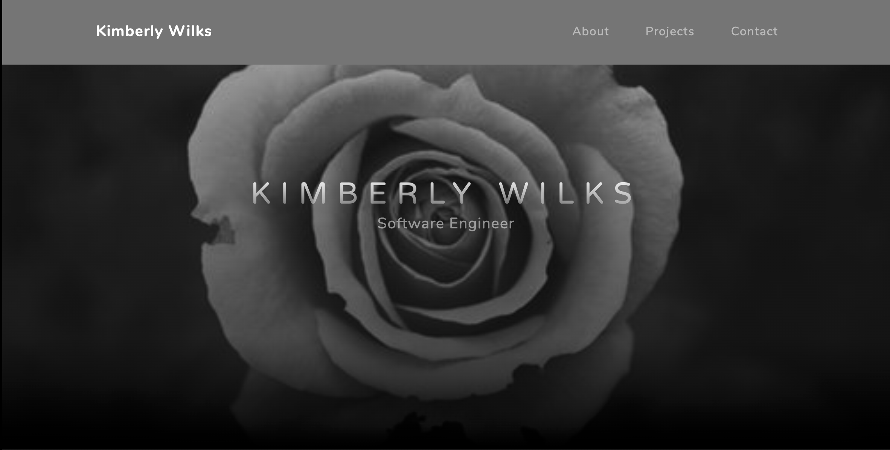

# Kim's Portfolio

My Portfolio has an about me page, a project page, and a contact page.
Here is the link to my deployed app! https://kwilksportfolio.herokuapp.com/

## What's in it?

My about me section has a little information about myself and a navbar that links to the rest of my information.

My projects section hosts the of projects I've completed. Click the title to access the github repo with the hosted page.

The contact form contains a page that allows people to contact me.

